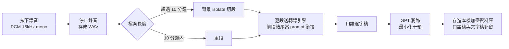

# VoiceType

**語音變文字，說完就整理好。**

VoiceType 是一款原始碼公開的語音轉文字工具。錄完音自動轉成逐字稿，再用 AI 潤飾成可讀的文字：去掉贅字、修好斷句、補上標點，不改你的語氣，不加標題。

用你自己的 API Key，資料存在你自己的裝置，沒有月費，沒有第三方伺服器。


<!-- 截圖預留區 — 歡迎提交 PR 補圖

-->

---

## 目錄

- [這個工具解決什麼問題](#這個工具解決什麼問題)
- [運作流程](#運作流程)
- [功能清單](#功能清單)
- [兩種轉錄引擎](#兩種轉錄引擎)
- [快速開始](#快速開始)
- [設定 API Key](#設定-api-key)
- [操作教學](#操作教學)
- [設定頁選項](#設定頁選項)
- [支援平台](#支援平台)
- [錄音與檔案規格](#錄音與檔案規格)
- [費用估算](#費用估算)
- [隱私與資料存放](#隱私與資料存放)
- [專案結構](#專案結構)
- [技術架構](#技術架構)
- [開發](#開發)
- [建置與發佈](#建置與發佈)
- [常見問題](#常見問題)
- [已知限制](#已知限制)
- [授權](#授權)
- [貢獻與聯絡](#貢獻與聯絡)

---

## 這個工具解決什麼問題

你可能遇過這些情況：

- 開會、上課想記錄，打字跟不上說話速度
- 靈感來了，開手機打字太慢，講出來卻沒地方接
- 錄了一大段語音備忘，回頭聽完全不想整理
- 想用 Otter.ai 或訊飛，但一個月十幾塊美金的訂閱，一年也不便宜

VoiceType 的做法：按一下開始講，講完自己會變成一篇整理好的文字。你花五分鐘說話，換到一篇能直接讀、能直接貼出去的稿子。

轉錄和潤飾走你自己申請的 API Key，按用量付費。錄一小時大約新台幣六塊，用多少算多少。

---

## 運作流程



轉錄中途關掉 App、斷網或當機都不會丟資料。未完成的 WAV 留在待轉錄佇列，下次開 App 自動接手續轉。

---

## 功能清單

### 錄音

- 大圓形按鈕一鍵開始／停止，錄音中顯示即時音量波形與計時器
- 想錄多久錄多久，二十、三十分鐘都可以
- 沒設金鑰也能先錄。錄完存進待轉錄佇列，設好金鑰自動接手
- Android 前景服務加常駐通知，iOS `audio` background mode。螢幕關掉、切到別的 App 都不會斷
- Android 主畫面 Widget，不開 App 直接開錄

### 轉錄

- 兩種引擎可切換：OpenAI Whisper 或 BytePlus Seed ASR（見[下一節](#兩種轉錄引擎)）
- 長錄音自動切段，切割在背景 isolate 執行，不卡 UI
- 每段自動帶入前段結尾當 prompt，多段接起來語意不斷裂
- 自訂詞彙表：把「臺積電」「TSMC」這類專有名詞加進去，轉錄優先採用
- 失敗自動重試，指數退避，最多四次
- App 重開自動掃描待轉錄佇列，依序續傳

### 潤飾

- GPT-4o-mini 以最小化干預原則修稿：刪贅字（呃、那個、然後、就是說）、拆過長的句子、補標點
- 不改你的語氣，不換成公文腔，不加小標題，俗語俚語原封不動留著
- 全文統一成臺灣繁體中文
- 口語原稿與潤飾稿都保留，隨時對照
- 潤飾稿可以在 App 裡直接改，也可以調整提示詞重新產一次

### 管理與匯出

- 歷史記錄自動存檔，可依今天／本週／本月篩選，或搜尋關鍵字
- 錄音日曆與熱力圖，看得到連續錄音天數
- 匯出 `.txt`（潤飾稿或口語稿）、`.md`、`.zip`（批次），走系統分享送到 Email、LINE、雲端硬碟
- 每次轉錄後顯示預估花費（新台幣）

### 桌面整合

- Windows、macOS、Linux 全域快捷鍵 `Ctrl` + `Alt` + `V` 切換錄音，不用切視窗
- 系統匣圖示與選單，可最小化到匣
- 轉錄完成時視窗不在前景才發系統通知

---

## 兩種轉錄引擎

轉錄可以在設定頁切換引擎，潤飾一律走 OpenAI GPT。

| | OpenAI Whisper | BytePlus Seed ASR |
|---|---|---|
| 模型 | `gpt-4o-mini-transcribe` | Seed ASR（`volc.seedasr.auc` / bigmodel） |
| 金鑰 | 與潤飾共用同一把 | 另外申請一把（`x-api-key`） |
| 呼叫方式 | 同步，直接回傳 | 非同步提交後輪詢，每 2 秒一次，最長等 10 分鐘 |
| 端點區域 | `api.openai.com` | `voice.ap-southeast-1.bytepluses.com` |
| 中文表現 | 夠用 | 中文辨識通常較準 |
| 輸出字形 | 直接要求臺灣繁體 | 語言碼 `zh-CN`，可能吐簡體，由潤飾階段統一轉繁 |
| 申請入口 | [platform.openai.com](https://platform.openai.com/api-keys) | [console.byteplus.com](https://console.byteplus.com/) |

只設 OpenAI 金鑰就能完整使用。BytePlus 是想要更準的中文辨識時才需要的選項。

---

## 快速開始

### 前置需求

| 項目 | 版本／說明 |
|---|---|
| Flutter SDK | Dart SDK `^3.11.4`，建議用 stable 通道最新版（CI 目前用 3.41.6） |
| OpenAI API Key | 轉錄與潤飾都要用，[取得方式](https://platform.openai.com/api-keys) |
| 平台建置工具 | Windows 要 Visual Studio C++ 工作負載；Android 要 Android Studio 與 SDK；macOS／iOS 要 Xcode；Linux 要 GTK 開發套件 |

### 安裝與執行

```bash
git clone https://github.com/domyweb666/VoiceType-app.git
cd VoiceType-app
flutter pub get
```

跑起來（挑你的平台）：

```bash
flutter run -d windows
flutter run -d macos
flutter run -d linux
flutter run -d android
flutter run -d ios
```

Android 裝置要記得開 USB 除錯，`flutter devices` 看得到才跑得起來。

---

## 設定 API Key

1. 開啟 VoiceType，點右上角齒輪進「設定」
2. 在「OpenAI API Key」貼上金鑰（長得像 `sk-proj-...`）
3. 想用 BytePlus 的話，另外在「BytePlus API Key」貼上第二把金鑰，並把轉錄引擎切成 BytePlus

金鑰存在平台原生安全儲存區，不是明文檔案：

| 平台 | 存放位置 |
|---|---|
| Windows | Credential Manager |
| macOS／iOS | Keychain |
| Android | Keystore（encrypted SharedPreferences） |
| Linux | libsecret |

舊版本曾把金鑰放在 SharedPreferences，首次讀取會自動搬進安全儲存區並刪掉舊值。

---

## 操作教學

### 第一步：錄音

- 點畫面中央的大圓形按鈕開始，再點一次停止
- 錄音中會顯示音量波形與計時
- 桌面版按 `Ctrl` + `Alt` + `V` 可以在任何視窗底下切換錄音
- 手機可以直接鎖螢幕或切到別的 App，錄音不會停

### 第二步：自動轉錄

- 停止錄音後自動開始轉錄
- 超過十分鐘的錄音自動切段，過程中顯示「轉錄第 2/5 段」這類進度
- 完成後顯示完整的口語逐字稿
- 沒設金鑰的話，這段錄音會留在首頁的待轉錄卡片裡，設好金鑰後點「全部轉錄」或單筆「轉錄」

### 第三步：一鍵潤飾

點「潤飾文字稿」，AI 會做這些事：

1. 刪掉無意義的發聲詞
2. 把過長或破碎的句子拆順
3. 補上標點

不會做這些事：改你的語氣、換成書面公文體、加小標題、把俗語改成正式用語。

潤飾完成後預設自動複製到剪貼簿，可以在設定頁關掉。

### 第四步：管理與匯出

- 歷史清單可依日期篩選或搜尋關鍵字
- 進到單筆記錄可以切換看口語稿或潤飾稿，潤飾稿能直接編輯
- 改過提示詞後可以重新潤飾，重跑一次
- 匯出：`.txt`（潤飾稿或口語稿）、`.md`、多筆打包成 `.zip`

---

## 設定頁選項

| 選項 | 說明 | 預設 |
|---|---|---|
| OpenAI API Key | 轉錄與潤飾共用 | 空 |
| BytePlus API Key | 只有選 BytePlus 引擎時要 | 空 |
| 轉錄引擎 | OpenAI／BytePlus | OpenAI |
| 自訂詞彙表 | 一行一個專有名詞，轉錄時優先採用 | 空 |
| 潤飾提示詞 | 可改 AI 潤飾的行為指引，可一鍵還原預設 | 內建提示詞 |
| 自動複製潤飾結果 | 潤飾完直接進剪貼簿 | 開 |
| 文字大小 | 0.9x／1.0x／1.15x／1.3x | 1.0x |
| 外觀主題 | 淺色／深色／跟隨系統 | 跟隨系統 |
| 隱私與費用說明 | 資料流向與計費方式 | — |

---

## 支援平台

| 平台 | 狀態 | 平台專屬功能 |
|---|---|---|
| Windows | 主要開發平台 | 系統匣、全域快捷鍵、自訂標題列、最小化到匣 |
| Android | 完整支援 | 前景服務背景錄音、常駐通知、主畫面 Widget |
| macOS | 支援（CI 有簽章公證管線） | 系統匣、全域快捷鍵 |
| iOS | 支援（CI 有 App Store 上傳管線） | `audio` background mode 背景錄音 |
| Linux | 支援 | 系統匣、全域快捷鍵 |
| Web | 未支援 | 只有 Flutter 預設的 web scaffold，錄音與安全儲存都沒有針對瀏覽器處理 |

---

## 錄音與檔案規格

| 項目 | 值 |
|---|---|
| 錄音格式 | PCM WAV，16 kHz／16 bit／單聲道 |
| 自動切段長度 | 每段最長 600 秒 |
| 單檔上限 | 25 MB（對齊 OpenAI 轉錄端點限制，上傳前本機先檢查） |
| 待轉錄佇列位置 | 應用程式文件目錄下 `voice_type/pending_transcription` |
| 轉錄重試 | 最多 4 次，首次失敗等 2 秒，之後每次乘 2 |
| 潤飾重試 | 最多 3 次，同樣指數退避 |
| prompt 銜接長度 | 200 字以內（含繁體提示與前段結尾） |

匯入外部音檔要注意：M4A 這類沒辦法在本機切段的格式，單檔超過 25 MB 會被擋下來。App 內錄的音檔會自動切段，不受影響。

---

## 費用估算

VoiceType 本身不收錢，費用來自你自己的 API 用量。

計價基準（寫在 `lib/services/cost_estimate_service.dart`）：

| 項目 | 單價 |
|---|---|
| 轉錄 | 每音訊分鐘 US$0.003 |
| 潤飾輸入 | 每 100 萬 token US$0.15 |
| 潤飾輸出 | 每 100 萬 token US$0.60 |
| 換算匯率 | 1 USD = 32 TWD |

估出來大概是這個量級：

| 錄音長度 | 約略花費 |
|---|---|
| 10 分鐘 | NT$1 |
| 20 分鐘 | NT$2 |
| 30 分鐘 | NT$3 |
| 60 分鐘 | NT$6 |

實際金額看語速與內容密度，以帳單為準。用 BytePlus 引擎時，App 顯示的轉錄費用仍照 OpenAI 價格估，BytePlus 那部分請看它自己的帳單。

拿來跟訂閱制比：Otter.ai 一個月約 US$17，一年 US$204。同樣的錢在 VoiceType 這邊可以錄一千小時以上，而且不錄的月份不用付。

---

## 隱私與資料存放

| 資料 | 存在哪 | 加密 |
|---|---|---|
| 逐字稿與歷史記錄 | 本機 Hive box | AES 加密，金鑰 32 bytes 由 `Hive.generateSecureKey()` 產生後存進系統安全儲存區 |
| API Key | 系統安全儲存區（Keychain／Credential Manager／Keystore／libsecret） | 由 OS 負責 |
| 偏好設定（引擎、字級、主題、提示詞、詞彙表） | SharedPreferences | 無，都不是敏感資料 |
| 錄音 WAV | 應用程式文件目錄，轉錄完成後刪除 | 無 |

其他要知道的：

- 沒有遙測，沒有分析 SDK，不收集使用數據
- 錄音檔只送到你選的轉錄服務（OpenAI 或 BytePlus），不經過開發者的任何伺服器
- 潤飾送的是文字稿，同樣直接對 OpenAI
- 開發者拿不到你的錄音與文字，因為根本沒有伺服器可以收

音訊會上傳到第三方進行轉錄，這件事無法避免，請自行評估內容敏感度。相關條款：[OpenAI 使用條款](https://openai.com/policies/terms-of-use)、[BytePlus 服務條款](https://www.byteplus.com/en/legal/terms-of-service)。

---

## 專案結構

```
lib/
├── main.dart                     入口，初始化 Hive／通知／桌面整合
├── app.dart                      MaterialApp、主題、Provider 註冊
├── config/
│   ├── constants.dart            模型名稱、端點、切段長度、潤飾提示詞
│   ├── app_theme.dart            淺／深色主題
│   └── user_disclosure.dart      隱私與費用說明文案
├── models/                       TranscriptRecord、TranscriptionSegment 等
├── providers/                    Provider 狀態層
│   ├── recording_provider.dart      錄音狀態與波形
│   ├── transcription_provider.dart  轉錄與潤飾流程
│   ├── history_provider.dart        歷史清單、篩選、搜尋
│   ├── pending_queue_provider.dart  待轉錄佇列
│   └── settings_provider.dart       設定與金鑰
├── screens/                      首頁、歷史、歷史詳情、設定
├── services/
│   ├── audio_recorder_service.dart      錄音
│   ├── wav_split_service.dart           背景 isolate 切段
│   ├── openai_service.dart              轉錄與潤飾 API
│   ├── byteplus_asr_service.dart        Seed ASR 提交與輪詢
│   ├── history_service.dart             Hive 讀寫
│   ├── hive_encryption_service.dart     資料庫加密金鑰
│   ├── secure_storage_service.dart      API Key 存取與舊版遷移
│   ├── pending_session_service.dart     待轉錄佇列
│   ├── export_service.dart              txt／md／zip 匯出
│   ├── cost_estimate_service.dart       費用估算
│   ├── recording_notification_service.dart  手機錄音通知
│   └── desktop_notify_service.dart      桌面完成通知
├── desktop/desktop_integration.dart  系統匣與全域快捷鍵
├── utils/openai_retry.dart           指數退避重試
└── widgets/                          UI 元件

android/app/src/main/kotlin/.../
├── RecordingForegroundService.kt   前景服務，獨佔錄音通知
└── RecordWidgetProvider.kt         主畫面 Widget

.github/workflows/
├── desktop-release.yml   macOS 建置、簽章、DMG、公證
└── ios-release.yml       iOS 建置、簽章、上傳 App Store Connect
```

---

## 技術架構

| 層級 | 用什麼 |
|---|---|
| 框架 | Flutter 3.11+／Dart |
| 狀態管理 | Provider |
| 本地資料庫 | Hive（AES 加密） |
| 安全儲存 | flutter_secure_storage |
| HTTP | Dio（自訂指數退避重試） |
| 錄音 | record（PCM 16 kHz／16 bit／mono） |
| 桌面整合 | window_manager、tray_manager、hotkey_manager、local_notifier |
| 手機通知 | flutter_local_notifications、原生前景服務 |
| 音訊 session | audio_session |
| 匯出與分享 | share_plus、archive、file_picker |
| 字型 | google_fonts |
| 轉錄 | OpenAI `gpt-4o-mini-transcribe` 或 BytePlus Seed ASR |
| 潤飾 | OpenAI `gpt-4o-mini` |

---

## 開發

```bash
flutter analyze
flutter test
flutter pub outdated
```

`flutter analyze` 應該是 `No issues found`，送 PR 前請確認。

改 App icon：把 1024×1024 的圖放到 `assets/icon/app_icon.png`，然後跑

```bash
dart run flutter_launcher_icons
```

Android、iOS、macOS、Windows 的各尺寸 icon 會一次生完（iOS 版會自動去掉 alpha 通道，App Store 不收帶透明的 1024 icon）。

---

## 建置與發佈

### 本機建置

```bash
flutter build windows --release
# build/windows/x64/runner/Release/
```

```bash
flutter build apk --release
# build/app/outputs/flutter-apk/app-release.apk

flutter build appbundle --release
# build/app/outputs/bundle/release/app-release.aab
```

```bash
flutter build macos --release
# build/macos/Build/Products/Release/VoiceType.app
```

```bash
flutter build ios --release --no-codesign
# build/ios/iphoneos/Runner.app
```

Android release 簽章要自己準備 keystore，把路徑與密碼寫進 `android/key.properties`（這個檔案不進版控，可參考 `android/key.properties.example`）。

### CI 發佈管線

推 `v*` 開頭的 tag 或手動 `workflow_dispatch` 會觸發：

| Workflow | 做什麼 |
|---|---|
| `desktop-release.yml` | macOS runner 建置 → Developer ID 簽章（含 Frameworks 逐顆簽）→ 簽完先啟動一次確認沒壞 → 打 DMG → notarytool 公證 → staple → 上傳 artifact |
| `ios-release.yml` | 建置 → Apple Distribution 簽章 → 匯出 IPA → 上傳 App Store Connect |

Windows 版在本機建，不走 CI，也不簽章。

自己 fork 想跑這兩條管線的話，要在 repo 設定裡放這些 secrets：

| Secret | 用途 |
|---|---|
| `APPLE_CERTIFICATE` / `APPLE_CERTIFICATE_PASSWORD` | Developer ID 憑證（macOS 桌面版） |
| `APPLE_SIGNING_IDENTITY` | 簽章身分字串 |
| `APPLE_ID` / `APPLE_PASSWORD` / `APPLE_TEAM_ID` | notarytool 公證 |
| `IOS_DIST_CERT_BASE64` / `IOS_DIST_CERT_PASSWORD` | Apple Distribution 憑證（iOS） |
| `IOS_PROVISIONING_PROFILE_BASE64` | App Store provisioning profile |
| `ASC_ISSUER_ID` / `ASC_KEY_ID` / `ASC_API_PRIVATE_KEY` | App Store Connect API 金鑰 |

---

## 常見問題

**要付錢給誰？**
付給 OpenAI（或 BytePlus），按用量。VoiceType 不收任何費用，也沒有伺服器可以向你收錢。

**沒有 API Key 可以先玩嗎？**
可以錄音，不能轉錄。錄好的音檔會排在待轉錄佇列，等你設好金鑰再一次處理。

**轉錄轉出簡體字怎麼辦？**
BytePlus Seed ASR 的語言碼是 `zh-CN`，逐字稿可能是簡體。潤飾階段會統一轉成臺灣繁體，只換字形不換詞。

**為什麼我的專有名詞老是打錯？**
設定頁的自訂詞彙表加進去，一行一個。這份清單會併進轉錄的 prompt。

**錄一小時會不會被切成很多段？**
會，每 600 秒一段，切割在背景 isolate 執行不會卡畫面。每段會帶前段結尾當提示，接起來不會斷句。

**匯入的 M4A 傳不上去？**
單檔超過 25 MB 就會被本機預檢擋掉。M4A 沒辦法在本機安全切段，請先自己剪短或轉成較短的 WAV。App 內錄的音檔會自動切段，不會遇到這個問題。

**手機錄音錄到一半被系統殺掉？**
Android 走前景服務加常駐通知，iOS 開了 `audio` background mode，正常情況不會斷。有些廠商的省電模式會硬殺背景行程，請把 VoiceType 加進電池最佳化的白名單。

**`Ctrl+Alt+V` 跟別的軟體衝突？**
目前快捷鍵寫死在 `lib/desktop/desktop_integration.dart`，還沒有設定介面。要改的話改那個檔案裡的 `HotKey` 設定重新建置。

**轉錄中途 App 掛掉，錄音會不會不見？**
不會。WAV 留在待轉錄佇列，下次開 App 自動掃描續轉。

**歷史記錄存在哪？可以備份嗎？**
存在本機 Hive box，加密過。目前沒有內建備份或同步，要留檔請用匯出功能（單筆 txt／md，或批次 zip）。

---

## 已知限制

- Web 版沒有實作，`web/` 只是 Flutter 預設 scaffold
- 沒有雲端同步，換裝置無法搬歷史記錄，只能匯出
- 桌面快捷鍵不能在 UI 裡改
- 費用估算對 BytePlus 引擎不準（照 OpenAI 價格算）
- 潤飾一定要 OpenAI 金鑰，換不掉
- 測試覆蓋率低，目前只有一支 widget test

---

## 授權

本專案採用 [Business Source License 1.1](LICENSE)。

可以：

- 個人使用、學習、研究
- 修改原始碼
- 非商業用途分發

不可以：

- 拿去做商業競品或 SaaS 服務

2030 年 4 月 13 日之後，自動轉為 Apache License 2.0。

BUSL 不是 OSI 認定的開源授權，所以這個專案準確的說法是「原始碼公開」而非「開源」。想商業使用請先來談。

---

## 貢獻與聯絡

Issue 和 Pull Request 都歡迎。送 PR 前請確認 `flutter analyze` 沒有 issue。

特別歡迎這幾類貢獻：

- 補截圖（README 的截圖區還空著）
- Linux 與 macOS 的實機測試回報
- 快捷鍵自訂介面
- 多語言介面

使用問題、功能許願、商業授權洽談：<https://domyweb.org/tools/voicetype/>

覺得好用可以[請我喝杯咖啡](https://portaly.cc/domyweb/support)。

---

## Star History

[](https://star-history.com/#domyweb666/VoiceType-app&Date)
